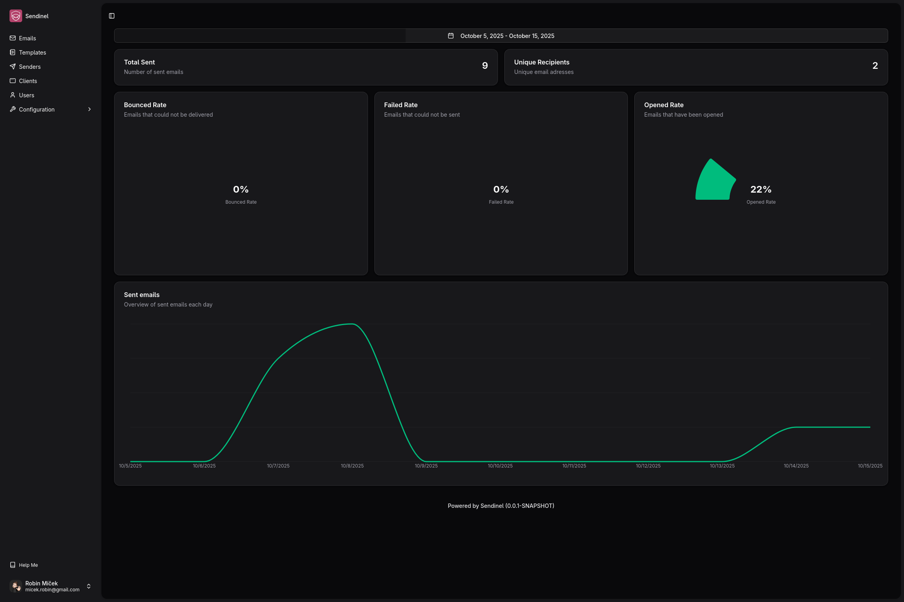

<div align="center">

  
  <h1>Sendinel</h1>
  
  <p>
    Guarding your emails, delivering your trust.
  </p>

<!-- Badges -->
  <p>
    <a href="">
      
    </a>
    <a href="https://github.com/RobinMicek/Sendinel/blob/master/LICENSE">
      
    </a>
  </p>

</div>

<!-- About the Project -->
## ⭐ About the Project
Sendinel is a lightweight service for sending transactional emails with ease. Instead of wrestling with multiple email providers, SDKs, and configuration headaches, Sendinel simplifies email delivery to just a single POST request, and your message is on its way.

With built-in support for popular email providers, Sendinel acts as your universal email gateway. You can define reusable templates, manage multiple sender identities, monitor statistics, and keep your email delivery consistent across projects.


<!-- Screenshots -->
### 📷 Screenshots

<div align="center"> 
  
</div>

<!-- Deployment -->
### 🚩 Deployment
Copy _.env.docker_ file to _.env_ and set the variables
```bash
cp .env.docker .env
```

Run using Docker

```bash
docker compose up -d
```

<!-- Contributing -->
## 👋 Contributing
Contributions are always welcome!

See [`CONTRIBUTING.md`](CONTRIBUTING.md) for ways to get started.